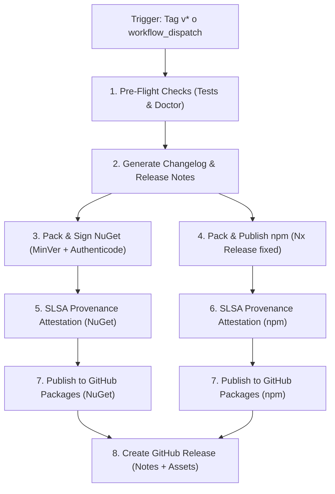

# Guía — Automatización de Releases y Provenance (`F8-13`)

Proceso automatizado, reproducible y seguro de release para BitCode.Framework (**Fase 8, F8-13**). Define la orquestación integral desde Conventional Commits hasta la publicación sincronizada de paquetes NuGet y npm con firma Authenticode, atestaciones de procedencia SLSA y GitHub Releases oficiales.

---

## 1. Principios de Release y Criterios del Gate de Fase 8

El Plan Maestro establece como Gate de salida de la Fase 8:
> **"Los paquetes tienen versionado, firma y provenance."**
> **"Crear una solución empresarial BitCode es un proceso repetible, seguro y documentado."**

Para satisfacer estas directrices, el pipeline implementa:

1. **Versionado SemVer Automatizado y Trazable**:
   - **Backend (.NET)**: [MinVer](https://github.com/adamralph/minver) (`src/Directory.Build.props`) calcula `Version` y `PackageVersion` a partir del tag SemVer más cercano (`v*`). La trazabilidad exacta al commit SHA se inyecta en `AssemblyInformationalVersion` y en el elemento `<repository commit="...">` vía Source Link.
   - **Frontend (Angular / TypeScript)**: [Nx Release](https://nx.dev/) versiona los 7 paquetes del monorepo (`@bitcode/*`) bajo el grupo `"fixed"`, garantizando paridad exacta de versión entre todos los componentes de la interfaz.

2. **Changelog Vivo Unificado**:
   - Generación automática de `CHANGELOG.md` estructurado mediante [`scripts/generate-changelog.mjs`](file:///c:/03_Laboral/Repositorio/BitCode.Framework/scripts/generate-changelog.mjs), clasificando commits en:
     - 💥 Breaking Changes
     - 🚀 Nuevas Capacidades (`feat`)
     - 🐛 Correcciones y Bug Fixes (`fix`)
     - ⚡ Rendimiento y Optimización (`perf`)
     - 📚 Documentación y Guías (`docs`)
     - 🏗️ Arquitectura, Tooling y Gobernanza (`refactor`, `chore`, `test`, `ci`)

3. **Firma Digital (Authenticode)**:
   - Los paquetes NuGet (`.nupkg`) se firman criptográficamente mediante `dotnet nuget sign` con estampado de tiempo RFC 3161 (`http://timestamp.digicert.com`). Si los secretos de firma no están configurados en GitHub (`NUGET_SIGNING_CERTIFICATE`), el pipeline lo reporta como advertencia en ejecuciones `dry_run` y falla de forma explícita en publicaciones reales de producción.

4. **Cadena de Suministro Segura y SLSA Provenance**:
   - Generación de atestaciones criptográficas (**SLSA Build Provenance**) mediante `actions/attest-build-provenance@v1`. Cada artefacto (`.nupkg`, `.snupkg`, `.tgz`) cuenta con un registro firmado por la infraestructura de GitHub que certifica el commit exacto, repositorio y pipeline donde fue compilado.

5. **Publicación Sincronizada a Registries**:
   - **NuGet**: Publicación al feed GitHub Packages vía `dotnet nuget push`.
   - **npm**: Publicación de tarballs `.tgz` y paquetes vía `npx nx release publish`.
   - **GitHub Releases**: Creación de la release oficial adjuntando las notas de versión y todos los binarios descargables.

---

## 2. Flujo de Trabajo para Mantenedores

### Paso 1: Simulación y Pre-Flight Check Local

Antes de publicar una nueva versión, el mantenedor ejecuta el script de simulación:

```powershell
# En Windows (PowerShell)
.\scripts\release.ps1 -DryRun

# En Linux / macOS (Bash)
./scripts/release.sh --dry-run
```

Este comando:
1. Comprueba que el working tree de Git esté limpio (`git status --porcelain`).
2. Ejecuta el diagnóstico de herramientas con `scripts/doctor.ps1 tools`.
3. Ejecuta la suite de pruebas de arquitectura (`BitCode.Architecture.Tests`).
4. Extrae los Conventional Commits desde el último tag y despliega una vista previa de las notas de release.

### Paso 2: Crear el Release Localmente

Una vez confirmados los cambios y definido el número de versión SemVer (ej. `0.2.0` o `1.0.0`):

```powershell
.\scripts\release.ps1 -Version "0.2.0"
```

El script:
- Actualiza el archivo raíz `CHANGELOG.md`.
- Genera el tag anotado en Git: `git tag -a v0.2.0 -m "Release v0.2.0"`.

### Paso 3: Disparar el Pipeline de CI/CD en GitHub

Para iniciar la compilación, firma y publicación oficial:

```bash
git push origin v0.2.0
```

El push del tag activa inmediatamente el workflow [`.github/workflows/release.yml`](file:///c:/03_Laboral/Repositorio/BitCode.Framework/.github/workflows/release.yml).

---

## 3. Disparo Manual desde GitHub Actions (`workflow_dispatch`)

Si se desea ensayar o publicar un release sin crear el tag localmente de antemano:

1. Ingrese a la pestaña **Actions** en el repositorio GitHub.
2. Seleccione el workflow **Release Automation**.
3. Haga clic en **Run workflow** y configure los parámetros:
   - `dry_run`: `true` para simular sin publicar, o `false` para publicar a los feeds.
   - `prerelease`: `true` si es una versión de prueba (alpha, beta, rc).

---

## 4. Estructura del Workflow de Release (`release.yml`)



---

## 5. Verificación de Provenance y Firma

Los consumidores del framework pueden verificar la autenticidad de los paquetes descargados:

### Verificación de Firma NuGet:
```bash
dotnet nuget verify BitCode.Framework.Shared.Kernel.0.2.0.nupkg
```

### Verificación de Provenance SLSA con GitHub CLI:
```bash
gh attestation verify BitCode.Framework.Shared.Kernel.0.2.0.nupkg --owner schildren
```
Este comando valida contra el libro de atestaciones de GitHub que el artefacto proviene de una compilación oficial del repositorio sin alteraciones intermedias.
